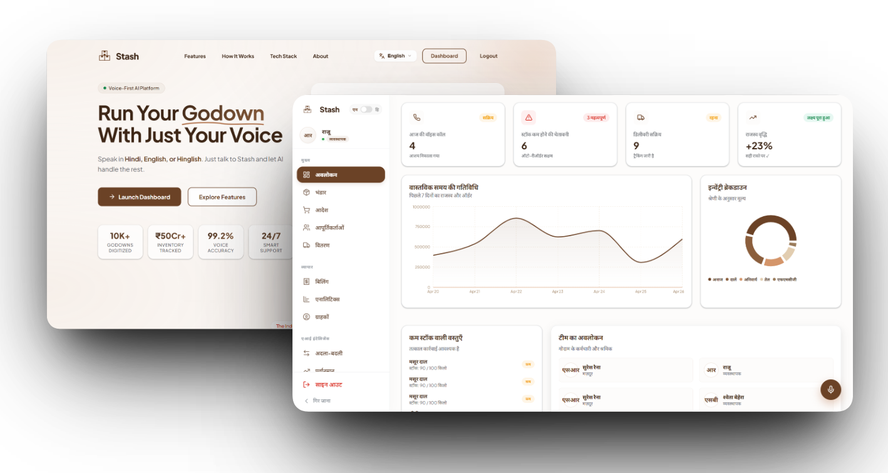
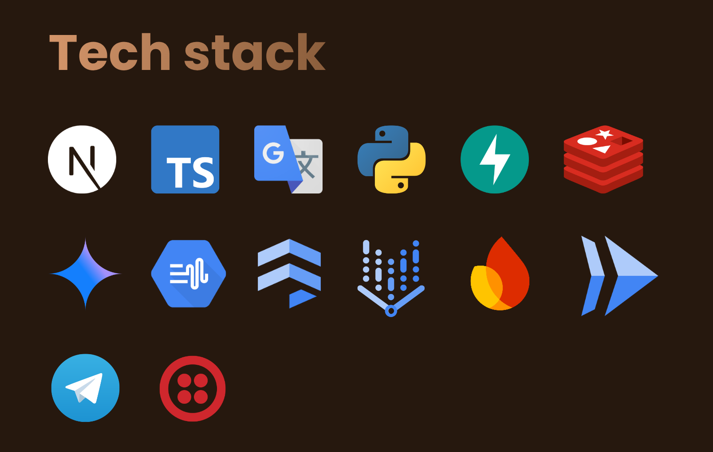

---

**STASH** is a high-performance, voice-native AI supply chain platform designed to modernize warehouse operations. By bridging the gap between physical inventory and digital intelligence, Stash empowers godown operators with multilingual voice control, predictive analytics, and automated logistics.

---



---

| Problem | How Our Solution Solves It |
| --- | --- |
| Manual stock tracking leads to errors | Voice-based stock updates with real-time syncing |
| Missed or delayed reorders | AI predicts demand and automates reordering |
| Constant back-and-forth with suppliers | Automated voice calls and supplier coordination |
| Payment delays and poor cash flow tracking | Automated billing, credit tracking, and reminders |

---

## ✨ Features

| Feature | Description |
| --- | --- |
| **Voice-First Operations** | **Multilingual Control:** Manage inventory, orders, and tasks using simple voice commands in English, Hindi, and Hinglish.<br>**Hands-Free Workflow:** Designed for warehouse floor efficiency where typing is a hurdle. |
| **Smart Inventory AI** | **Real-Time Tracking:** Instant stock updates with discrepancy alerts.<br>**Stock Intelligence:** AI-driven demand prediction and reordering logic to prevent stockouts. |
| **Automated Supply Chain** | **Supplier Automation:** Auto-place orders with primary and backup suppliers based on stock levels.<br>**AI Negotiation:** Handle price negotiations within margin rules with user oversight. |
| **Order & Logistics** | **Voice-Based Ordering:** Enable buyers to place and track orders via voice.<br>**Delivery Tracking:** Real-time monitoring with automated follow-ups and status updates. |
| **Financial Intelligence** | **Billing & Payments:** Generate GST-compliant invoices and automate payment reminders.<br>**Credit Tracking:** Keep tabs on supplier and buyer credit effortlessly. |
| **Warehouse Synergy** | **Multi-Warehouse Management:** Manage multiple godowns under one account with consolidated visibility and inter-warehouse transfers.<br>**Unified Intelligence:** A central AI layer that learns and improves warehouse operations continuously. |

---



---

## 🌍 Sustainable Development Goals (SDGs)

This product is committed to and supports the following **Sustainable Development Goals**:
*   **SDG 8:** Decent Work and Economic Growth
*   **SDG 9:** Industry, Innovation, and Infrastructure
*   **SDG 12:** Responsible Consumption and Production
*   **SDG 13:** Climate Action

---

## Setup Instructions

### 1. Clone the repository
```bash
git clone https://github.com/shwet46/Stash.git
cd Stash
cp .env.example .env
```

### 2. Set up the AI Backend
Navigate to the `backend` directory and install dependencies using `uv`.
```bash
cd backend
uv sync
uv run uvicorn app.main:app --reload
```
*Note: Make sure you have Python 3.12+ and `uv` installed.*

### 3. Set up the Frontend
Navigate to the `frontend` directory and install the Node dependencies.
```bash
cd ../frontend
npm install
npm run dev
```
*Note: Make sure you have Node.js 20+ installed.*

### 4. Docker Deployment (Optional)
Run the entire stack (including Redis and Firestore emulators) with a single command:
```bash
docker-compose up --build
```

---

## 👥 Team members

<table align="center">
  <tr>
    <td align="center" width="200">
      <br>
      <b>Ojasvi Doye</b><br>
      <a href="https://github.com/ojasvi004">@ojasvi004</a>
    </td>
    <td align="center" width="200">
      <br>
      <b>Maitri Dalvi</b><br>
      <a href="https://github.com/maitri707">@maitri707</a>
    </td>
    <td align="center" width="200">
      <br>
      <b>Shweta Behera</b><br>
      <a href="https://github.com/shwet46">@shwet46</a>
    </td>
  </tr>
</table>

---

## 📜 License

This project is licensed under the MIT License. See the [LICENSE](LICENSE) file for details.
